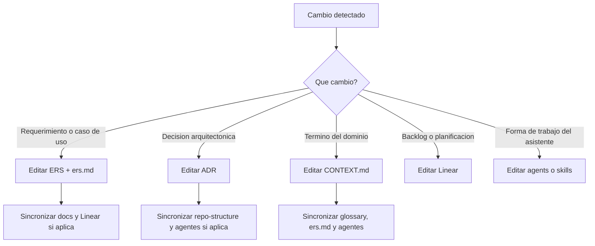

# Mapeo de Specs

Mapa operativo de la documentacion del proyecto UMBRAL: que vive en cada carpeta, que archivo editar segun el tipo de cambio y como se relacionan `ERS`, `ADR`, `CONTEXT`, agentes, skills y Linear.

## 1. Estructura actual

```text
/
|- AGENTS.md
|- CLAUDE.md
|- CONTEXT-MAP.md
|- README/
|  |- Enunciado Original Proyecto Umbral.md
|  |- ERS UMBRAL .md
|  `- mapeo de Specs.md
|- docs/
|  |- architecture/
|  `- product/
|- infra/
|  |- keycloak/
|  `- postgres/
|- src/
|  |- apps/
|  |  |- edge-proxy/
|  |  `- web/
|  `- services/
|     |- identity-access/
|     |- mission-design/
|     |- scoring-audit/
|     `- session-operations/
`- .agents/
   |- agents/
   `- skills/
```

## 2. Que guarda cada capa

| Capa | Proposito | Que si va aqui | Que no va aqui |
| --- | --- | --- | --- |
| `README/ERS UMBRAL .md` | Fuente funcional detallada | requerimientos, reglas, casos de uso, restricciones tecnicas impuestas | backlog vivo o decisiones internas no acordadas |
| `README/Enunciado Original Proyecto Umbral.md` | marco academico base | lineamientos del curso, alcance docente, criterios de evaluacion | verdad operativa si contradice al ERS detallado |
| `docs/product/ers.md` | SSoT operativo resumido | resumen normalizado del ERS, aclaratorias resueltas, decisiones funcionales cerradas | detalle extenso del documento academico completo |
| `docs/product/open-questions.md` | ambiguedades abiertas | dudas pendientes y contradicciones | decisiones ya cerradas |
| `src/services/*/CONTEXT.md` | lenguaje del dominio | terminos canonicos, significado, limites y relaciones semanticas | librerias, frameworks o estructura de carpetas |
| `src/apps/*` | entrypoints tecnicos y frontend | borde tecnico, front web, adaptadores de entrada | lenguaje de dominio o reglas de negocio |
| `CONTEXT-MAP.md` | mapa entre contextos | bounded contexts y relaciones | detalle interno de cada contexto |
| `docs/architecture/adr/*.md` | decisiones dificiles de revertir | trade-offs y consecuencias | reglas triviales o detalles temporales |
| `docs/architecture/repo-structure.md` | estructura real del repo | carpetas existentes y convenciones | estructura deseada que todavia no existe |
| `.agents/agents/*.md` | contrato operativo de agentes | que leer, que hacer, que no asumir | logica de dominio duplicada |
| `.agents/skills/*` | procedimientos reutilizables | workflows, checklists y guias de actualizacion | fuente de verdad de producto |
| Linear | backlog vivo | issues, estado, triage y planificacion | documentacion estable de arquitectura o dominio |

## 3. Regla de precedencia

Cuando haya conflicto entre fuentes:

1. `README/ERS UMBRAL .md` manda sobre el enunciado academico para comportamiento de producto.
2. `docs/product/ers.md` debe reflejar fielmente esa prioridad en formato operativo.
3. `src/*/CONTEXT.md` manda sobre vocabulario.
4. `docs/architecture/adr/*.md` manda sobre decisiones arquitectonicas aceptadas.
5. Linear manda sobre estado de backlog y trabajo pendiente.
6. `.agents/agents` y `.agents/skills` deben adaptarse a lo anterior.

## 4. Donde se ponen restricciones tecnicas

Si la tecnologia viene impuesta por el proyecto o el profesor, documentarla en:

- `README/ERS UMBRAL .md`
- `docs/product/ers.md`

Si ademas la decision necesita justificacion y consecuencias, crear o actualizar un ADR.

Ejemplos:

- `Keycloak` para identidad.
- `MediatR` para CQRS.
- `SignalR` para tiempo real.
- `RabbitMQ` para mensajeria.
- microservicios reales desde el inicio.

## 5. Cuando editar cada archivo

### Cambia un requerimiento, regla de negocio o caso de uso

Editar en este orden:

1. `README/ERS UMBRAL .md`
2. `docs/product/ers.md`
3. `docs/product/open-questions.md` si se cierra o abre una ambiguedad
4. `src/*/CONTEXT.md` solo si cambia significado de un termino
5. ADR solo si arrastra una decision arquitectonica relevante
6. `.agents/agents/*.md` si altera como deben trabajar los agentes
7. Linear si cambia alcance de issues existentes

### Cambia una decision arquitectonica

Editar en este orden:

1. `docs/architecture/adr/*.md`
2. `docs/architecture/repo-structure.md` si cambia organizacion real
3. `docs/product/ers.md` si impacta comportamiento operativo
4. `.agents/agents/*.md`
5. skills afectadas
6. Linear si cambia el backlog

### Cambia el lenguaje del dominio

Editar en este orden:

1. `src/services/*/CONTEXT.md`
2. `CONTEXT-MAP.md` si cambian relaciones
3. `docs/product/glossary.md`
4. `docs/product/ers.md` si usa el termino
5. agentes y skills que usen ese vocabulario

### Cambia solo el backlog

Editar Linear. No crear copias locales del backlog salvo export temporal explicito.

### Cambia solo la forma de operar de Codex o Claude

Editar:

1. `AGENTS.md`
2. `CLAUDE.md` solo si hay delta especifico de Claude
3. `.agents/agents/*.md`
4. `.agents/skills/*`

## 6. Arbol de decision rapido



## 7. Checklist minimo al tocar specs

- Cambio que debe hacer el sistema?
- Cambio el vocabulario del dominio?
- Cambio una decision dificil de revertir?
- Algun agente quedo desalineado?
- Algun skill quedo ensenando un flujo viejo?
- `docs/product/ers.md` sigue representando el ERS detallado?
- Linear sigue reflejando el backlog vivo?
