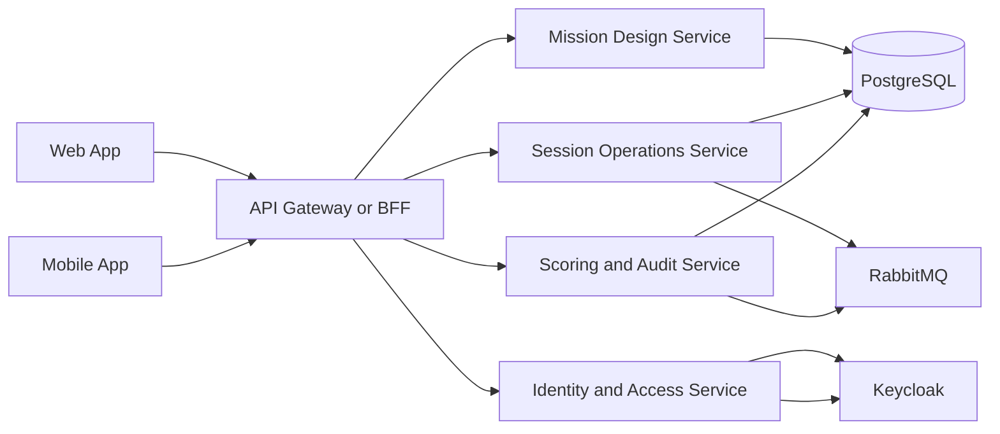
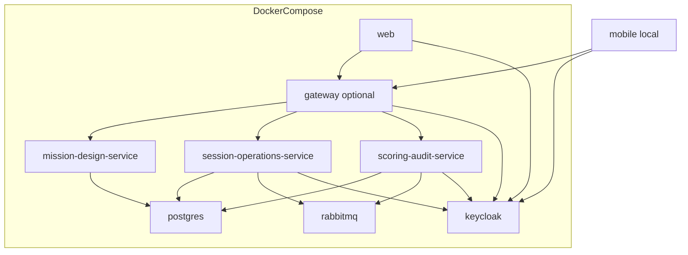
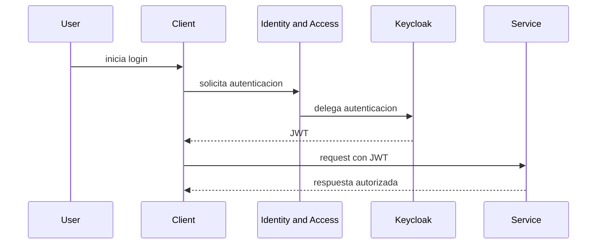
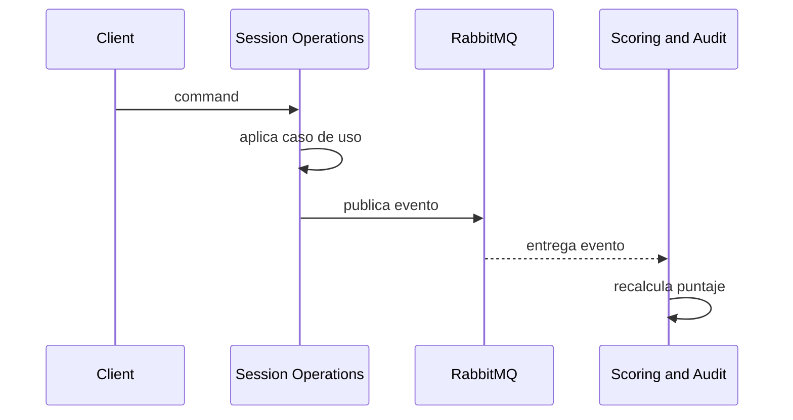
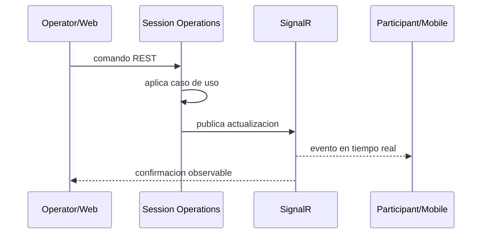

# Infrastructure Outline

Bosquejo inicial de la infraestructura de UMBRAL para una arquitectura de microservicios real desde el dia uno, con integracion hibrida: comunicacion sincronica como mecanismo principal y mensajeria asincrona solo para responsabilidades secundarias. Incluye desarrollo local en `docker-compose` y evolucion futura hacia despliegue en nube y `CI/CD`.

## Objetivo

Definir los componentes minimos necesarios para empezar a implementar la solucion bajo un enfoque de microservicios reales, manteniendo compatibilidad con despliegue local, nube y automatizacion futura.

## Principios

- Empezar con microservicios reales, no con un monolito modular disfrazado.
- Separar capacidades de negocio por bounded context.
- Diferenciar modulos logicos de tecnologias concretas.
- Usar comunicacion sincronica como camino principal entre servicios.
- Reservar la mensajeria asincrona para procesos secundarios donde realmente aporte valor.
- Preparar el sistema para evolucion en nube y `CI/CD`.

## Arquitectura logica

Los microservicios del sistema se alinean con los bounded contexts y capacidades principales:

- `Mission Design Service`
- `Session Operations Service`
- `Scoring and Audit Service`
- `Identity and Access Service`

La implementacion actual de `Identity and Access Service` se apoya en `Keycloak` como proveedor de identidad.

## Componentes base

### 1. Mission Design Service

Responsabilidad:

- gestionar misiones
- gestionar stages, nodos, subetapas y pistas
- soportar reutilizacion de plantillas de stages
- exponer datos base para creacion de sesiones

Tecnologia esperada:

- `.NET`
- `MediatR`
- `EF Core`

### 2. Session Operations Service

Responsabilidad:

- gestionar sesiones en vivo
- gestionar equipos y progreso
- aceptar evidencias operativas
- coordinar el flujo en tiempo real
- publicar eventos del dominio operativo

Tecnologia esperada:

- `.NET`
- `MediatR`
- `SignalR`
- `EF Core`

### 3. Scoring and Audit Service

Responsabilidad:

- calcular puntajes
- aplicar penalizaciones
- mantener ranking derivado
- registrar historial auditable
- reaccionar a eventos del flujo operativo

Tecnologia esperada:

- `.NET`
- `MediatR`
- `EF Core`
- consumidor y publicador de `RabbitMQ`

### 4. Identity and Access Service

Responsabilidad:

- gestionar autenticacion
- gestionar autorizacion
- resolver roles y permisos
- exponer la capacidad de identidad al resto del sistema

Implementacion inicial:

- `Keycloak` como proveedor de identidad
- `JWT` como token consumido por los servicios

Nota:

- a nivel de arquitectura se habla de `Identity and Access Service`
- a nivel tecnologico se usa `Keycloak`

### 5. API Gateway o BFF

Responsabilidad sugerida:

- entrada unificada para clientes
- enrutamiento a microservicios
- simplificar auth para clientes
- centralizar preocupaciones de borde si hace falta

Estado:

- recomendado para evolucion
- puede omitirse en el primer esqueleto si el alcance obliga a ir mas rapido

### 6. Web

Responsabilidad:

- interfaz para `Administrator` y `Operator`
- consumo de APIs
- consumo de tiempo real

### 7. Mobile

Responsabilidad:

- experiencia del `Participant`
- consumo de APIs
- consumo de tiempo real
- escaneo QR

### 8. RabbitMQ

Responsabilidad:

- desacoplar eventos secundarios
- soportar auditoria e historial
- permitir reaccion asincrona donde no haga falta respuesta inmediata

### 9. PostgreSQL

Responsabilidad:

- persistencia principal de los servicios

Decision pendiente de infraestructura:

- una BD fisica con esquemas separados por servicio
- o varias BDs fisicas, una por servicio

Para el inicio, si necesitan reducir complejidad operativa, pueden correr una sola instancia de `PostgreSQL` con separacion logica por servicio.

## Topologia logica

## Vista local con `docker-compose`

## Comunicacion entre microservicios

### Sincrona

Usar para:

- consultas necesarias en linea
- acciones que requieren respuesta inmediata
- coordinacion principal entre servicios

Mecanismos posibles:

- REST
- gRPC en una fase posterior si hace falta

### Asincrona

Usar para:

- auditoria
- historial
- notificaciones secundarias
- eventos de dominio que no deban bloquear el flujo principal
- actualizaciones que no deben bloquear el flujo principal

Mecanismo:

- `RabbitMQ`

## Orquestacion vs coreografia

Las colas no son por si solas la orquestacion.

### Coreografia

Sirve cuando:

- un servicio publica un evento
- otros servicios reaccionan sin coordinador central fuerte

Ejemplo:

- `Session Operations Service` publica `EvidenceValidated`
- `Scoring and Audit Service` recalcula puntaje

### Orquestacion

Sirve cuando:

- un flujo de negocio requiere coordinacion explicita
- un servicio o proceso decide el siguiente paso

Ejemplo posible:

- `Session Operations Service` coordina flujo principal de sesion
- otros servicios reaccionan o responden

### Recomendacion para UMBRAL

- usar comunicacion sincronica como ruta principal entre microservicios
- usar `coreografia` solo para eventos secundarios y desacoplamiento
- mantener la autoridad del flujo principal en `Session Operations Service`
- evitar inventar una capa de orquestacion distribuida compleja desde el primer dia si no hay una necesidad real

## Responsabilidades por frontera

### Clientes <-> Gateway

- entrada unificada si se usa gateway
- autenticacion inicial
- simplificacion de endpoints para web y mobile

### Gateway <-> Microservicios

- enrutamiento
- composicion basica si hace falta
- no meter logica de dominio aqui

### Servicios <-> Identity and Access

- validacion de tokens
- autorizacion por roles y permisos
- separacion entre identidad y dominio central

### Identity and Access <-> Keycloak

- `Keycloak` implementa la capacidad de identidad
- no debe confundirse la herramienta con el nombre del bounded context

### Servicios <-> PostgreSQL

- cada servicio debe tender a ser dueño de sus datos
- si comparten una sola instancia al inicio, deben seguir manteniendo separacion logica

### Servicios <-> RabbitMQ

- intercambio de eventos
- procesamiento asincrono
- desacoplamiento de responsabilidades

### Session Operations <-> Scoring and Audit

- preferir integracion sincronica si el flujo necesita respuesta inmediata
- usar eventos cuando la operacion pueda resolverse en segundo plano

## Eventos asincronos a definir

Eventos minimos sugeridos:

- `MissionPublished`
- `EvidenceSubmitted`
- `EvidenceValidated`
- `PenaltyApplied`
- `SessionFinished`
- `AuditEntryRequested`

## Tiempo real

`SignalR` sigue siendo el mecanismo de tiempo real, pero concentrado principalmente en `Session Operations Service`.

Eventos de tiempo real a cerrar:

- cambio de estado de sesion
- liberacion de pistas
- actualizacion de ranking
- avance de etapa por equipo
- evidencia que requiere atencion del operador
- revelacion de soluciones al finalizar

## Variables de entorno sugeridas

### Mission Design Service

- `ConnectionStrings__Postgres`
- `Auth__Authority`
- `Auth__Audience`

### Session Operations Service

- `ConnectionStrings__Postgres`
- `RabbitMQ__Host`
- `RabbitMQ__User`
- `RabbitMQ__Password`
- `Auth__Authority`
- `Auth__Audience`
- `SignalR__Enabled`

### Scoring and Audit Service

- `ConnectionStrings__Postgres`
- `RabbitMQ__Host`
- `RabbitMQ__User`
- `RabbitMQ__Password`
- `Auth__Authority`
- `Auth__Audience`

### Identity and Access / Keycloak

- `KEYCLOAK_ADMIN`
- `KEYCLOAK_ADMIN_PASSWORD`
- realm, client ids y secrets

### Gateway

- urls internas de servicios
- configuracion de auth

### Web

- `VITE_GATEWAY_URL` o urls de servicios si no hay gateway
- `VITE_AUTH_URL`
- `VITE_SIGNALR_URL`

### Mobile

- `API_URL` o gateway
- `AUTH_URL`
- `SIGNALR_URL`

## Secuencia base de autenticacion

## Secuencia base de evento entre servicios

## Secuencia base de tiempo real

## Camino de evolucion hacia nube

### Fase 1: local

- `docker-compose`
- contenedores por microservicio
- una instancia de `PostgreSQL`
- una instancia de `RabbitMQ`
- `Keycloak`

### Fase 2: pre-cloud

- healthchecks
- imagenes versionadas
- configuracion por ambiente
- pipelines de build y test
- contratos entre servicios mas estrictos

### Fase 3: cloud

- despliegue independiente por servicio
- secretos gestionados por plataforma
- observabilidad centralizada
- balanceo, TLS y dominio

## `CI/CD` futuro en GitHub Actions

Sin implementarlo aun, el pipeline futuro deberia cubrir:

1. restore e install
2. build por microservicio
3. tests por microservicio
4. build web
5. validacion basica de `docker-compose`
6. build de imagenes
7. push a registry
8. despliegue por ambiente

## Decisiones ya asumidas por este bosquejo

- arquitectura de microservicios real desde el inicio
- `CQRS` logico con `MediatR`
- `SignalR` para tiempo real
- `Identity and Access` como capacidad logica
- `Keycloak` como implementacion inicial de identidad
- comunicacion sincronica como mecanismo principal entre servicios
- `RabbitMQ` para mensajeria asincrona secundaria
- `docker-compose` como entorno inicial local

## Preguntas que no bloquean el bosquejo, pero si la implementacion detallada

- si habra gateway desde el primer sprint o despues
- si cada servicio tendra base separada fisicamente o compartiran una instancia inicial
- que eventos seran solo internos y cuales tendran contratos estables
- que permisos finos se definiran ademas de roles
- que flujos requeriran orquestacion explicita y cuales funcionaran por coreografia
