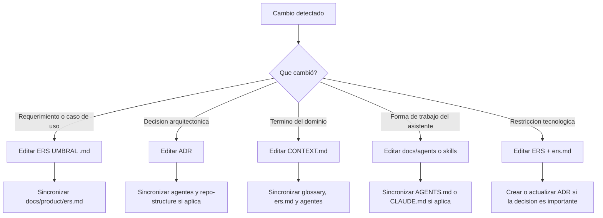
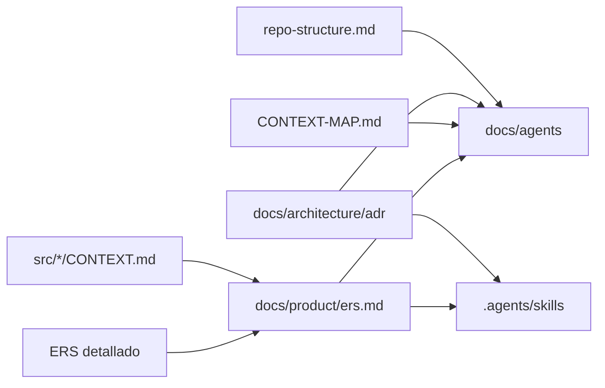
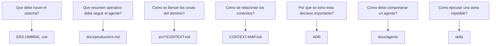

# Mapeo de Specs

Mapa operativo de la documentación del proyecto UMBRAL: qué vive en cada carpeta, qué archivo editar según el tipo de cambio y cómo se relacionan `ERS`, `ADR`, `CONTEXT`, agentes y skills.

## 1. Estructura actual

```text
/
|- AGENTS.md
|- CLAUDE.md
|- CONTEXT-MAP.md
|- Enunciado Proyecto Umbral.md
|- ERS UMBRAL .md
|- ERS - Grupo 2 - UMBRAL (5).md
|- mapeo de Specs.md
|- docs/
|  |- agents/
|  |  |- operating-model.md
|  |  |- domain.md
|  |  |- issue-tracker.md
|  |  |- triage-labels.md
|  |  `- *-agent.md
|  |- architecture/
|  |  |- repo-structure.md
|  |  `- adr/
|  `- product/
|     |- ers.md
|     |- glossary.md
|     `- open-questions.md
|- src/
|  |- mission-design/
|  |  `- CONTEXT.md
|  |- session-operations/
|  |  `- CONTEXT.md
|  |- scoring-audit/
|  |  `- CONTEXT.md
|  `- identity-access/
|     `- CONTEXT.md
`- .agents/
   `- skills/
```

## 2. Qué guarda cada capa

| Capa | Propósito | Qué sí va aquí | Qué no va aquí |
| --- | --- | --- | --- |
| `ERS UMBRAL .md` | Fuente de verdad funcional detallada | requerimientos, reglas, casos de uso, restricciones técnicas impuestas | decisiones internas de implementación no acordadas |
| `Enunciado Proyecto Umbral.md` | marco académico base | lineamientos del curso, alcance docente, criterios de evaluación | verdad operativa si contradice al ERS detallado |
| `docs/product/ers.md` | SSoT operativo resumido | resumen normalizado del ERS, aclaratorias resueltas, decisiones funcionales ya cerradas | detalles extensos del documento académico completo |
| `docs/product/open-questions.md` | lista de ambigüedades abiertas | contradicciones, dudas pendientes, preguntas de producto | decisiones ya cerradas |
| `src/*/CONTEXT.md` | lenguaje del dominio | términos canónicos, significado, límites, relaciones semánticas | librerías, frameworks, estructura de carpetas |
| `CONTEXT-MAP.md` | mapa entre contextos | bounded contexts y relaciones entre ellos | detalle interno de cada contexto |
| `docs/architecture/adr/*.md` | decisiones importantes | decisiones difíciles de revertir, trade-offs, consecuencias | reglas triviales o detalles de naming |
| `docs/architecture/repo-structure.md` | estructura real del repo | carpetas existentes, convenciones de organización | estructura soñada que aún no existe |
| `docs/agents/*.md` | contrato de trabajo de agentes | qué leer, qué hacer, qué no asumir | lógica del dominio o arquitectura detallada duplicada |
| `.agents/skills/*` | procedimientos reutilizables | workflows, checklists, guías de actualización | fuente de verdad del producto |

## 3. Regla de precedencia

Cuando haya conflicto entre fuentes:

1. `ERS UMBRAL .md` manda sobre el enunciado académico para el comportamiento del producto.
2. `docs/product/ers.md` debe reflejar fielmente esa prioridad.
3. `CONTEXT.md` manda sobre el vocabulario.
4. `ADR` manda sobre decisiones arquitectónicas ya formalizadas.
5. `docs/agents` y `.agents/skills` deben adaptarse a lo anterior, no competir con ello.

## 4. Dónde se ponen restricciones técnicas

### Si la tecnología viene impuesta por el proyecto o el profesor

Ponerla en:

- `ERS UMBRAL .md`
- `docs/product/ers.md`

Ejemplos:

- `Keycloak` para identidad
- `MediatR` para CQRS
- `SignalR` para tiempo real
- `RabbitMQ` para mensajería

### Si además la decisión necesita justificación y consecuencias

Formalizarla en un `ADR`.

Ejemplos típicos:

- usar `Keycloak` como proveedor de identidad
- usar `SignalR` como implementación de tiempo real
- usar `MediatR` para aplicación CQRS
- modelar la solución como monolito modular y no microservicios

### Si solo afecta la forma de trabajo del asistente

Reflejarla también en:

- `docs/agents/backend-agent.md`
- `docs/agents/devops-agent.md`
- skill especializado si aplica

## 5. Cuándo editar cada archivo

### Cambia un requerimiento, regla de negocio o caso de uso

Editar en este orden:

1. `ERS UMBRAL .md`
2. `docs/product/ers.md`
3. `docs/product/open-questions.md` si dejó de ser una ambigüedad o si abrió una nueva
4. `src/*/CONTEXT.md` solo si cambió el significado de un término
5. `ADR` solo si ese cambio arrastra una decisión arquitectónica
6. `docs/agents/*.md` si altera cómo deben trabajar los agentes

### Cambia una decisión arquitectónica

Editar en este orden:

1. `docs/architecture/adr/*.md`
2. `docs/architecture/repo-structure.md` si cambia la organización real
3. `docs/product/ers.md` si impacta el SSoT operativo
4. `docs/agents/*.md`
5. skills afectadas

### Cambia el lenguaje del dominio

Editar en este orden:

1. `src/*/CONTEXT.md`
2. `CONTEXT-MAP.md` si cambian relaciones entre contextos
3. `docs/product/glossary.md`
4. `docs/product/ers.md` si usa el término
5. agentes y skills que usen ese vocabulario

### Cambia una restricción tecnológica

Editar en este orden:

1. `ERS UMBRAL .md`
2. `docs/product/ers.md`
3. `ADR` si es una decisión relevante
4. agentes técnicos
5. skills de mantenimiento o actualización

### Cambia solo la forma de operar de Codex o Claude

Editar:

1. `AGENTS.md`
2. `CLAUDE.md`
3. `docs/agents/*.md`
4. `.agents/skills/*`

## 6. Árbol de decisión rápido



## 7. Flujo de propagación de cambios



## 8. Qué preguntas responde cada documento



## 9. Guía práctica con ejemplos

### Ejemplo A: el profesor exige `Keycloak`

Editar:

1. `ERS UMBRAL .md`
2. `docs/product/ers.md`
3. crear ADR si quieren justificar por qué `Keycloak`
4. ajustar agente backend y devops

No editar:

- `CONTEXT.md`, salvo que cambie un término del dominio

### Ejemplo B: `Trivia` cambia la validación

Editar:

1. `ERS UMBRAL .md`
2. `docs/product/ers.md`
3. `open-questions.md` si se cerró o abrió una ambigüedad
4. `src/session-operations/CONTEXT.md` si cambia el significado de `Validation Outcome`
5. `ADR` solo si modifica una decisión arquitectónica relevante

### Ejemplo C: se adopta microservicios en vez de monolito modular

Editar:

1. `ADR`
2. `repo-structure.md`
3. `docs/product/ers.md` si afecta decisiones operativas
4. agentes técnicos
5. skills relacionadas con arquitectura o cambios de spec

## 10. Regla simple para no perderse

Usa esta heurística:

- si cambia **qué hace** el sistema: `ERS`
- si cambia **cómo se nombran** las cosas: `CONTEXT`
- si cambia **por qué o cómo se organiza** la solución: `ADR`
- si cambia **cómo trabaja el asistente**: `agents`
- si cambia **cómo se ejecuta una tarea repetida**: `skills`

## 11. Checklist mínimo al tocar specs

- ¿cambió la fuente de verdad funcional?
- ¿cambió el vocabulario del dominio?
- ¿cambió una decisión difícil de revertir?
- ¿algún agente quedó desalineado?
- ¿algún skill quedó enseñando un flujo viejo?
- ¿`docs/product/ers.md` sigue representando el ERS detallado?
